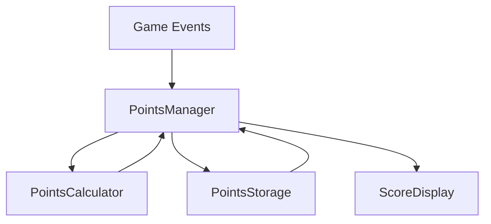

# Points System Overview

## Architecture Overview

The Points System is a modular TypeScript implementation for tracking, calculating, and displaying points in the Mugshot Matching Game. The system is built with a focus on maintainability, extensibility, and reliability.

### Core Architecture Principles

- **Separation of Concerns**: Each component has a single, well-defined responsibility
- **Type Safety**: Comprehensive TypeScript interfaces ensure type safety across the system
- **Error Handling**: Structured error handling with custom error types
- **Configurability**: Flexible configuration system for scoring rules and behavior
- **Persistence**: Multiple storage options with automatic fallback

## Component Relationships

The system consists of the following key components:

### 1. PointsManager
- Central coordinator for the points system
- Manages game session state
- Coordinates between other components
- Handles state persistence

### 2. PointsCalculator
- Calculates points based on match results
- Applies scoring rules:
  - Base points for correct matches
  - Time bonuses for quick matches
  - Penalties for multiple attempts
- Validates point calculations

### 3. PointsStorage
- Handles persistence of points data
- Implementations:
  - LocalStorage (primary)
  - MemoryStorage (fallback)
- Manages:
  - Current session points
  - Historical high scores
  - Last updated timestamps

### 4. ScoreDisplay
- Manages UI representation of points
- Handles score animations
- Provides error state display
- Ensures accessibility compliance

## Data Flow

### 1. Game Event Flow
1. Game triggers match completion event
2. PointsManager receives match result
3. PointsCalculator determines points earned
4. PointsManager updates internal state
5. ScoreDisplay updates UI
6. PointsStorage persists new state

### 2. Data Persistence Flow
1. PointsManager triggers save operation
2. PointsStorage validates state
3. Primary storage attempt (LocalStorage)
4. Fallback to MemoryStorage if needed
5. Confirmation of save completion

### 3. State Recovery Flow
1. System initialization
2. PointsStorage loads saved state
3. PointsManager validates loaded data
4. ScoreDisplay updates with current state
5. System ready for operation

## System Boundaries

### Input Boundaries
- Match completion events
- Game reset triggers
- Configuration updates
- Storage availability changes

### Output Boundaries
- Score display updates
- Animation triggers
- Storage operations
- Error notifications

## Security Considerations

1. **Data Validation**
   - All input data is validated
   - Points calculations are bounded
   - Storage data is sanitized

2. **Error Handling**
   - Structured error types
   - Graceful fallbacks
   - User-friendly error messages

3. **State Protection**
   - Immutable state objects
   - Controlled state updates
   - Validation before persistence

## Performance Optimizations

1. **Calculation Efficiency**
   - Minimal recalculation
   - Bounded point values
   - Efficient validation

2. **Storage Optimization**
   - Batched storage operations
   - Efficient state serialization
   - Storage quota management

3. **Display Performance**
   - Optimized animations
   - Efficient DOM updates
   - Debounced display updates